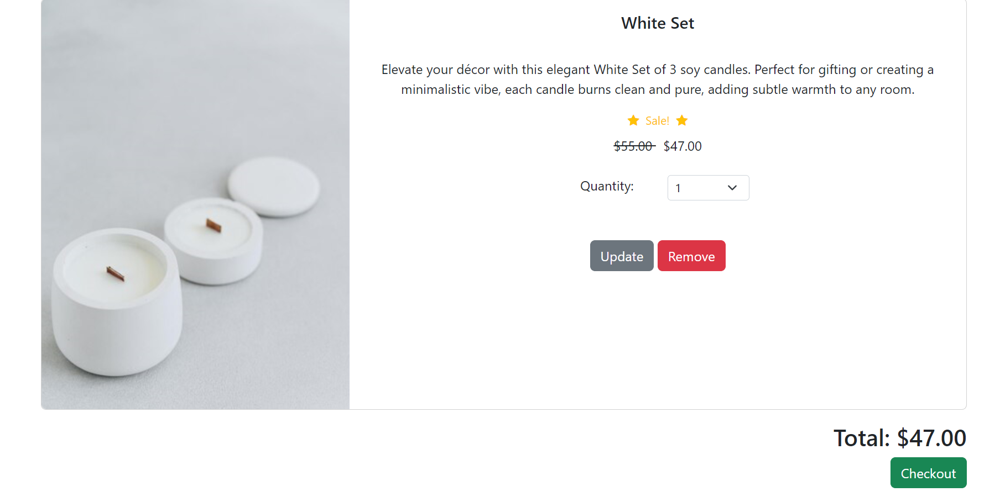
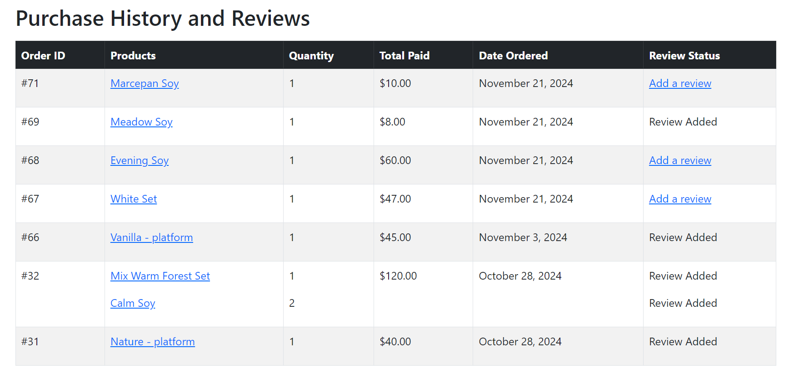
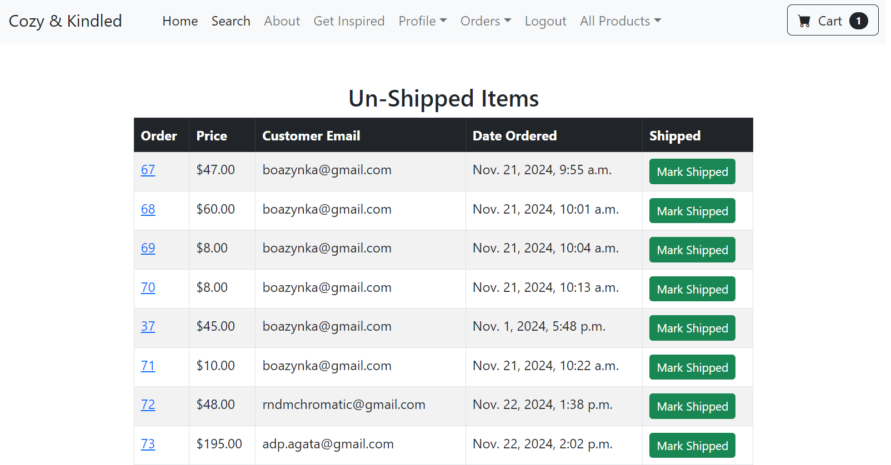
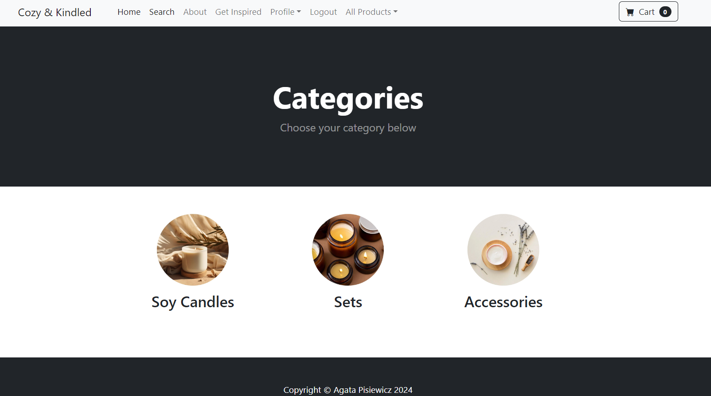

# Soy Candle E-commerce Store
[Link to the Store](https://django-ecom-candles-production.up.railway.app)

#### This is an e-commerce store project built with Django REST Framework for selling soy candles. The project features user authentication, shopping cart functionality, order management, and various enhancements to improve the shopping experience. The front-end is styled using Bootstrap to ensure a responsive and user-friendly design.

---
## Functionality

The store provides the following features:

- User Account Creation: Users can create an account to manage their orders and personal information.
- Add to Cart: Both logged-in and guest users can add items to their cart.
- Checkout and Purchase: Users can proceed to checkout, and PayPal is integrated for payment processing (note: This is a portfolio website. All transactions occur in a sandbox environment for testing purposes only. No real payments will be processed. Please avoid using real credit card information during checkout.).
- Order Confirmation: After a purchase, customers will receive an order confirmation email containing the list of items ordered and the total price.
- Order History: Users can view their order history in their account profile.
- Product Reviews: Logged-in users can add reviews for products (1 review per item).
- Password Management: Users can change their password, and if forgotten, they can request a password reset link to be sent to their email.
- Sorting: Users can sort items by price to find what fits their budget.
- Search: Users can search for items available in the store.
- Inspirational Quotes: On the "Get Inspired" page, users can generate random inspirational quotes using the ZenQuotes API.
---

## Screenshots

